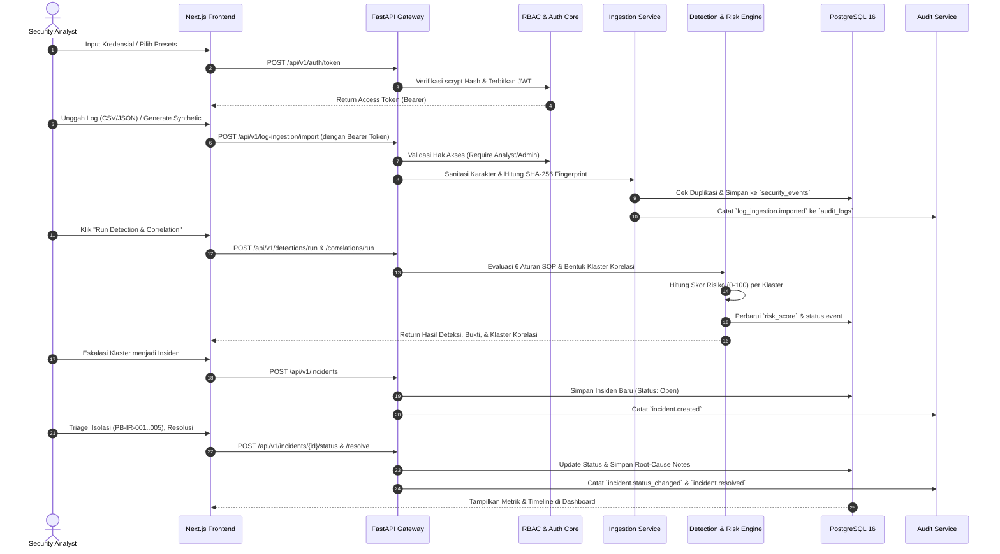

# Diagram Aliran Data (Data Flow) SATRIA SENTINEL

Diagram ini mendeskripsikan siklus lengkap pergerakan data dari input pengguna atau telemetri log hingga tampil di dashboard operasional:

```mermaid
sequenceDiagram
    autonumber
    actor Analyst as Security Analyst
    participant UI as Next.js Frontend
    participant API as FastAPI Gateway
    participant Auth as RBAC & Auth Core
    participant Ingest as Ingestion Service
    participant Detect as Detection & Risk Engine
    participant DB as PostgreSQL 16
    participant Audit as Audit Service

    Analyst->>UI: Input Kredensial / Pilih Presets
    UI->>API: POST /api/v1/auth/token
    API->>Auth: Verifikasi scrypt Hash & Terbitkan JWT
    Auth-->>UI: Return Access Token (Bearer)

    Analyst->>UI: Unggah Log (CSV/JSON) / Generate Synthetic
    UI->>API: POST /api/v1/log-ingestion/import (dengan Bearer Token)
    API->>Auth: Validasi Hak Akses (Require Analyst/Admin)
    API->>Ingest: Sanitasi Karakter & Hitung SHA-256 Fingerprint
    Ingest->>DB: Cek Duplikasi & Simpan ke `security_events`
    Ingest->>Audit: Catat `log_ingestion.imported` ke `audit_logs`

    Analyst->>UI: Klik "Run Detection & Correlation"
    UI->>API: POST /api/v1/detections/run & /correlations/run
    API->>Detect: Evaluasi 6 Aturan SOP & Bentuk Klaster Korelasi
    Detect->>Detect: Hitung Skor Risiko (0-100) per Klaster
    Detect->>DB: Perbarui `risk_score` & status event
    Detect-->>UI: Return Hasil Deteksi, Bukti, & Klaster Korelasi

    Analyst->>UI: Eskalasi Klaster menjadi Insiden
    UI->>API: POST /api/v1/incidents
    API->>DB: Simpan Insiden Baru (Status: Open)
    API->>Audit: Catat `incident.created`

    Analyst->>UI: Triage, Isolasi (PB-IR-001..005), Resolusi
    UI->>API: POST /api/v1/incidents/{id}/status & /resolve
    API->>DB: Update Status & Simpan Root-Cause Notes
    API->>Audit: Catat `incident.status_changed` & `incident.resolved`
    DB-->>UI: Tampilkan Metrik & Timeline di Dashboard
```
