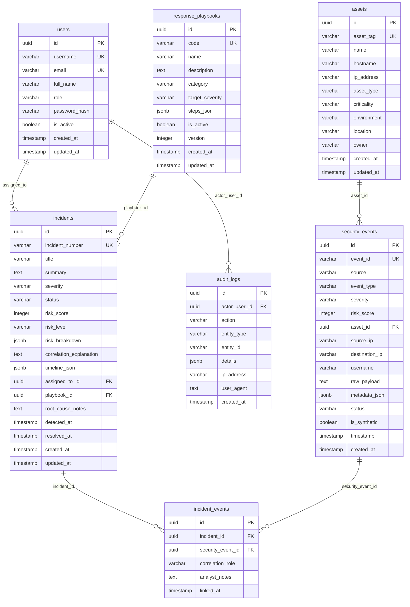

# Diagram Entitas Relasi Database (ERD)

Diagram Entity-Relationship ini menggambarkan 7 tabel relasional yang dikelola oleh SQLAlchemy dan termigrasi penuh di PostgreSQL 16:

```mermaid
erDiagram
    users ||--o{ incidents : "assigned_to"
    users ||--o{ audit_logs : "actor_user_id"
    assets ||--o{ security_events : "asset_id"
    response_playbooks ||--o{ incidents : "playbook_id"
    incidents ||--o{ incident_events : "incident_id"
    security_events ||--o{ incident_events : "security_event_id"

    users {
        uuid id PK
        varchar username UK
        varchar email UK
        varchar full_name
        varchar role
        varchar password_hash
        boolean is_active
        timestamp created_at
        timestamp updated_at
    }

    assets {
        uuid id PK
        varchar asset_tag UK
        varchar name
        varchar hostname
        varchar ip_address
        varchar asset_type
        varchar criticality
        varchar environment
        varchar location
        varchar owner
        timestamp created_at
        timestamp updated_at
    }

    security_events {
        uuid id PK
        varchar event_id UK
        varchar source
        varchar event_type
        varchar severity
        integer risk_score
        uuid asset_id FK
        varchar source_ip
        varchar destination_ip
        varchar username
        text raw_payload
        jsonb metadata_json
        varchar status
        boolean is_synthetic
        timestamp timestamp
        timestamp created_at
    }

    incidents {
        uuid id PK
        varchar incident_number UK
        varchar title
        text summary
        varchar severity
        varchar status
        integer risk_score
        varchar risk_level
        jsonb risk_breakdown
        text correlation_explanation
        jsonb timeline_json
        uuid assigned_to_id FK
        uuid playbook_id FK
        text root_cause_notes
        timestamp detected_at
        timestamp resolved_at
        timestamp created_at
        timestamp updated_at
    }

    incident_events {
        uuid id PK
        uuid incident_id FK
        uuid security_event_id FK
        varchar correlation_role
        text analyst_notes
        timestamp linked_at
    }

    response_playbooks {
        uuid id PK
        varchar code UK
        varchar name
        text description
        varchar category
        varchar target_severity
        jsonb steps_json
        boolean is_active
        integer version
        timestamp created_at
        timestamp updated_at
    }

    audit_logs {
        uuid id PK
        uuid actor_user_id FK
        varchar action
        varchar entity_type
        varchar entity_id
        jsonb details
        varchar ip_address
        text user_agent
        timestamp created_at
    }
```
