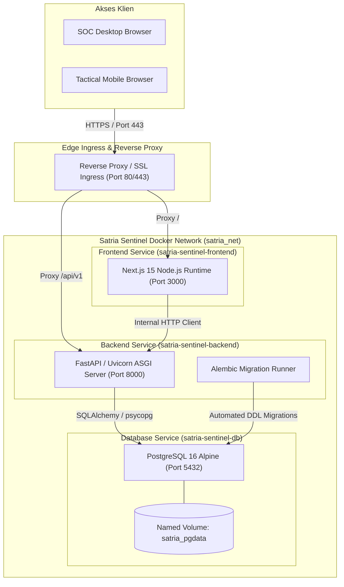

# Diagram Arsitektur Penerapan (Deployment Architecture)

Diagram ini mengilustrasikan opsi implementasi deployment baik secara kontainer lokal (Docker Compose) maupun cloud deployment:

```mermaid
graph TD
    subgraph Users["Akses Klien"]
        BrowserDesk["SOC Desktop Browser"]
        BrowserMob["Tactical Mobile Browser"]
    end

    subgraph ProductionEdge["Edge Ingress & Reverse Proxy"]
        NginxProxy["Reverse Proxy / SSL Ingress (Port 80/443)"]
    end

    subgraph ContainerNetwork["Satria Sentinel Docker Network (satria_net)"]
        subgraph FrontendContainer["Frontend Service (satria-sentinel-frontend)"]
            NextServer["Next.js 15 Node.js Runtime (Port 3000)"]
        end

        subgraph BackendContainer["Backend Service (satria-sentinel-backend)"]
            FastAPIServer["FastAPI / Uvicorn ASGI Server (Port 8000)"]
            AlembicEngine["Alembic Migration Runner"]
        end

        subgraph DatabaseContainer["Database Service (satria-sentinel-db)"]
            PostgresServer["PostgreSQL 16 Alpine (Port 5432)"]
            PersistentVol[("Named Volume: satria_pgdata")]
        end
    end

    Users -->|HTTPS / Port 443| NginxProxy
    NginxProxy -->|Proxy /| NextServer
    NginxProxy -->|Proxy /api/v1| FastAPIServer

    NextServer -->|Internal HTTP Client| FastAPIServer
    FastAPIServer -->|SQLAlchemy / psycopg| PostgresServer
    PostgresServer --- PersistentVol
    AlembicEngine -->|Automated DDL Migrations| PostgresServer
```
