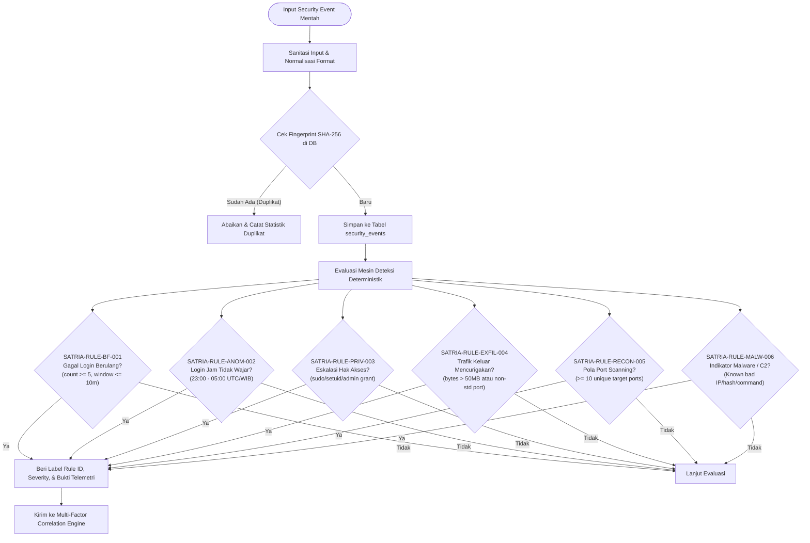

# Diagram Alur Deteksi Ancaman (Detection Flow)

Diagram alur ini merinci evaluasi 6 aturan deteksi deterministik berbasis SOP keamanan siber:

```mermaid
flowchart TD
    StartEvent(["Input Security Event Mentah"]) --> Sanitization["Sanitasi Input & Normalisasi Format"]
    Sanitization --> Deduplication{"Cek Fingerprint SHA-256 di DB"}
    Deduplication -- "Sudah Ada (Duplikat)" --> SkipEvent["Abaikan & Catat Statistik Duplikat"]
    Deduplication -- "Baru" --> InsertDB["Simpan ke Tabel security_events"]
    
    InsertDB --> RuleEngine["Evaluasi Mesin Deteksi Deterministik"]
    
    RuleEngine --> R1{"SATRIA-RULE-BF-001<br/>Gagal Login Berulang?<br/>(count >= 5, window <= 10m)"}
    RuleEngine --> R2{"SATRIA-RULE-ANOM-002<br/>Login Jam Tidak Wajar?<br/>(23:00 - 05:00 UTC/WIB)"}
    RuleEngine --> R3{"SATRIA-RULE-PRIV-003<br/>Eskalasi Hak Akses?<br/>(sudo/setuid/admin grant)"}
    RuleEngine --> R4{"SATRIA-RULE-EXFIL-004<br/>Trafik Keluar Mencurigakan?<br/>(bytes > 50MB atau non-std port)"}
    RuleEngine --> R5{"SATRIA-RULE-RECON-005<br/>Pola Port Scanning?<br/>(>= 10 unique target ports)"}
    RuleEngine --> R6{"SATRIA-RULE-MALW-006<br/>Indikator Malware / C2?<br/>(Known bad IP/hash/command)"}

    R1 -- Ya --> TagFinding["Beri Label Rule ID, Severity, & Bukti Telemetri"]
    R2 -- Ya --> TagFinding
    R3 -- Ya --> TagFinding
    R4 -- Ya --> TagFinding
    R5 -- Ya --> TagFinding
    R6 -- Ya --> TagFinding

    R1 -- Tidak --> NextStep["Lanjut Evaluasi"]
    R2 -- Tidak --> NextStep
    R3 -- Tidak --> NextStep
    R4 -- Tidak --> NextStep
    R5 -- Tidak --> NextStep
    R6 -- Tidak --> NextStep

    TagFinding --> Correlate["Kirim ke Multi-Factor Correlation Engine"]
```
