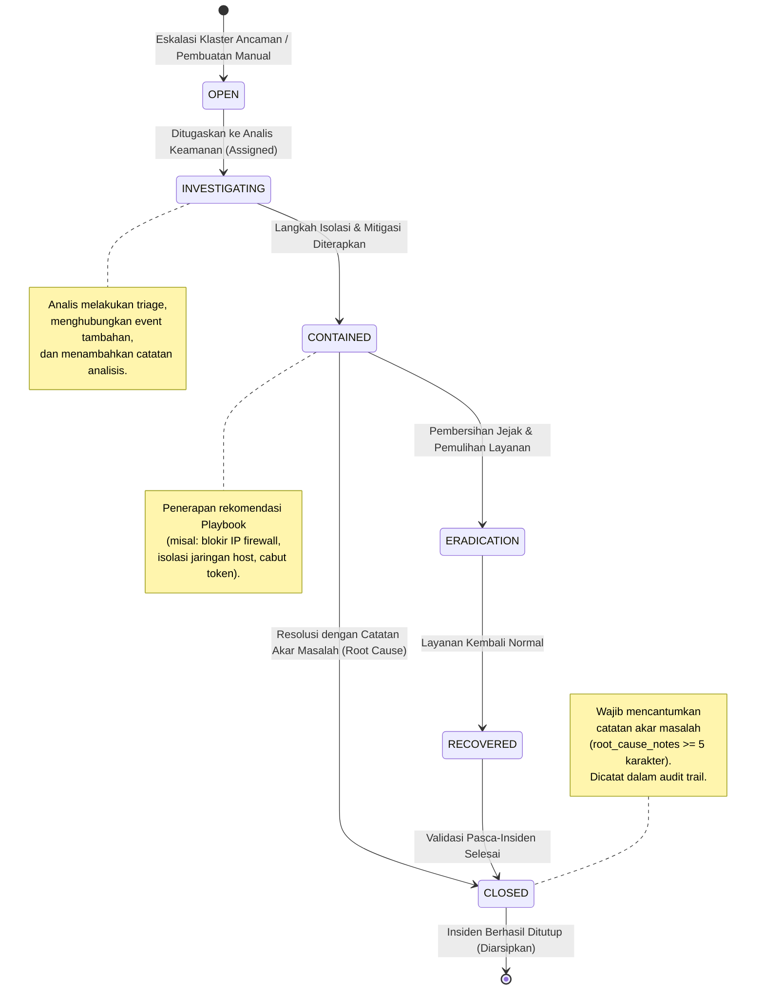

# Diagram Siklus Hidup Insiden (Incident Lifecycle)

Diagram ini mengilustrasikan transisi status insiden yang selaras dengan panduan penanganan insiden NIST SP 800-61 dan ISO/IEC 27035:

```mermaid
stateDiagram-v2
    [*] --> OPEN: Eskalasi Klaster Ancaman / Pembuatan Manual

    OPEN --> INVESTIGATING: Ditugaskan ke Analis Keamanan (Assigned)
    note right of INVESTIGATING
      Analis melakukan triage,
      menghubungkan event tambahan,
      dan menambahkan catatan analisis.
    end note

    INVESTIGATING --> CONTAINED: Langkah Isolasi & Mitigasi Diterapkan
    note right of CONTAINED
      Penerapan rekomendasi Playbook
      (misal: blokir IP firewall,
      isolasi jaringan host, cabut token).
    end note

    CONTAINED --> ERADICATION: Pembersihan Jejak & Pemulihan Layanan
    ERADICATION --> RECOVERED: Layanan Kembali Normal
    
    CONTAINED --> CLOSED: Resolusi dengan Catatan Akar Masalah (Root Cause)
    RECOVERED --> CLOSED: Validasi Pasca-Insiden Selesai

    CLOSED --> [*]: Insiden Berhasil Ditutup (Diarsipkan)

    note left of CLOSED
      Wajib mencantumkan
      catatan akar masalah
      (root_cause_notes >= 5 karakter).
      Dicatat dalam audit trail.
    end note
```
